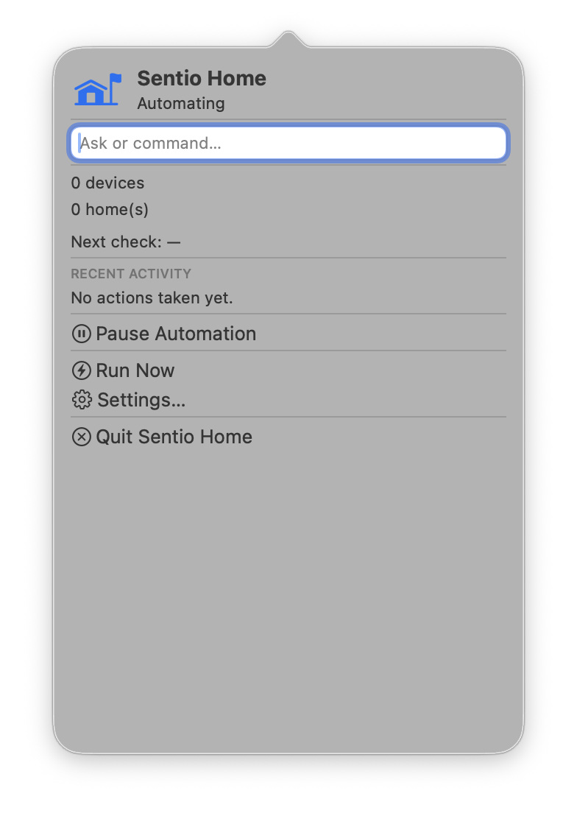
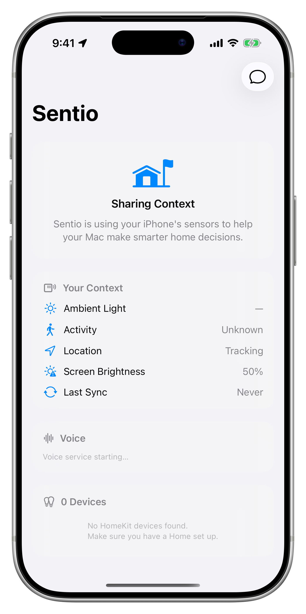

# SentioHome

An ambient smart home automation system powered by Apple's on-device AI (FoundationModels). SentioHome observes your home context — time, presence, device states, screen activity, calendar, weather, and health data — then makes intelligent decisions about lighting, music, climate, and communication without manual rules or scenes.

## Screenshots

<p align="center">
  
  &nbsp;&nbsp;&nbsp;
  
</p>

## Architecture

SentioHome runs as a **Mac Catalyst menu bar app** (the server) with companion apps on **iOS** and **watchOS** that provide sensor data via CloudKit.

```
macOS (Server)                    iOS (Companion)           watchOS (Companion)
─────────────────                 ───────────────           ───────────────────
AutomationScheduler               LocationService           HealthService
  ├─ ContextEngine                SensorService               (heart rate, HRV,
  ├─ IntelligenceEngine           VoiceService                 sleep, temperature)
  │    └─ FoundationModels          (tap-to-talk,
  ├─ HomeKitService                  Siri integration)
  ├─ VoiceService                 RemoteChatView
  ├─ MusicService (MusicKit)      CompanionOnboardingView
  ├─ ScreenActivityService
  ├─ CalendarService                      ▲
  ├─ GuestDetectionService                │
  ├─ NetworkDiscoveryService              │
  ├─ BLEScannerService            CloudKit (private DB)
  ├─ EmergencyHandler                     │
  ├─ OverrideTracker                      ▼
  ├─ PreferenceMemory
  └─ ConversationManager          All companion data syncs
                                  bidirectionally via CloudKit
```

### Key Concepts

- **Automation cycles** run every 1–5 minutes (adaptive). Each cycle builds a context prompt, sends it to the on-device AI model, and executes the resulting plan.
- **Override detection** watches for manual adjustments after AI actions. If you change a light the AI just set, it backs off for 30 minutes and learns your preference.
- **Emergency handling** monitors smoke, CO, and water leak sensors. Shuts down HVAC (to stop circulating dangerous air) and closes water valves automatically.
- **Guest detection** uses Bluetooth, network device discovery, and motion correlation to infer when guests are present — adjusts automation behavior accordingly.
- **Multi-turn voice conversations** via AirPods tap-to-talk or Siri on any device. The AI can control devices, play music, and chat naturally.

## Requirements

- macOS 26+ (Apple Silicon with Apple Intelligence)
- Xcode 26+
- [XcodeGen](https://github.com/yonaskolb/XcodeGen) (`brew install xcodegen`)
- Apple Developer account (for HomeKit, CloudKit, MusicKit entitlements)
- HomeKit-compatible devices

## Setup

1. **Clone and generate the Xcode project:**
   ```bash
   git clone https://github.com/swparkaust/SentioHome.git
   cd SentioHome
   xcodegen generate
   ```

2. **Configure signing:**
   - Open `SentioHome.xcodeproj` in Xcode
   - Select each target and set your development team
   - Xcode will auto-provision the required capabilities (HomeKit, CloudKit, HealthKit)

3. **Configure CloudKit:**
   - The app auto-initializes the CloudKit schema on first launch
   - Ensure your iCloud account is signed in on all devices

4. **Configure MusicKit:**
   - Register a Media ID in the [Apple Developer portal](https://developer.apple.com/account/resources/identifiers/list/mediaId)
   - Use the same bundle ID prefix as the app (`com.sentio.home`)

5. **Build and run:**
   - **macOS:** Run the `SentioHomeRun` scheme (Mac Catalyst)
   - **iOS:** Run the `SentioCompanion` scheme on your iPhone
   - **watchOS:** Run the `SentioWatch` scheme on your Apple Watch

## Project Structure

```
SentioHome/
├── project.yml              # XcodeGen project definition
├── Shared/
│   ├── Models/              # Data models (@Generable for FoundationModels)
│   └── Services/            # Cross-platform services
├── macOS/
│   ├── App/                 # App entry point, menu bar, settings
│   ├── Services/            # macOS-specific services
│   └── AppKitPlugin/        # Native AppKit for NSStatusItem
├── iOS/
│   ├── App/                 # Companion app entry point
│   ├── Services/            # Location, sensors, voice
│   ├── Views/               # SwiftUI views
│   └── Intents/             # Siri App Intents
├── watchOS/
│   ├── App/                 # Watch app entry point
│   ├── Services/            # HealthKit integration
│   └── Views/               # Watch UI
└── Tests/
    ├── SharedTests/         # Model and service unit tests
    ├── MacOSTests/          # macOS service tests
    └── IntegrationTests/    # Cross-service integration tests
```

## Testing

```bash
xcodegen generate
xcodebuild test -scheme SentioAllTests -destination 'platform=macOS'
```

## License

[MIT](LICENSE)
